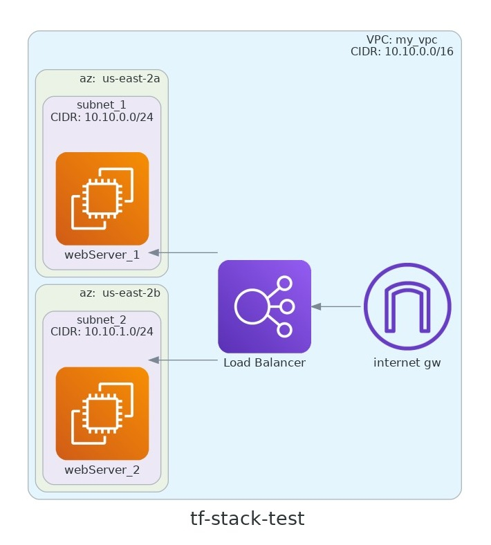

# Terraform stack test

The goal of this config is to create a load balancer and 2 compute instances with nginx and apache

The input variables have default values already set to create a VPC, 2 subnets on 2 different availability zones, an internet gateway, a route for the vpc to reach internet, and 2 security groups (to allow traffic from internet to the lb, and to allow traffic from the lb to the compute instances)




## Usage

To run this you will need to set the access_key and secret_key vars.

```
$ export TF_VAR_access_key="AKIA6AZ....."
$ export TF_VAR_secret_key="HUhvzjfcCO......."

```
Next, run the following commands, and review the proposed changes before running the apply
```
$ terraform init
$ terraform plan
$ terraform apply
```
The input variables can be modified to change de number of compute instances(add more elements to the webservers_app list, each item is a webserver to be deployed), the size of the subnets to create, the number of AZ to use for the subnets, etc

## Inputs

| Name | Description | Type | Default_value |
| -----|-------------|------|---------------|
| access_key | access key for provider | `string` | n/a |
| secret_key | secret key for provider | `string` | n/a |
| region | AWS region for main VPC | `string` | us-east-2 |
| vpc_cidr | Main VPC cidr block | `string` | 10.10.0.0/16 |
| subnet_newbit | Extra bits for the subnets netmask  | `number` | 8 |
| az_count | # of availability zones to use | `number` | 2 |
| webservers_type | instance type | `string` | t3.micro |
| webservers_app | Application to be deploy per server. Implicitly defines how many servers will be created ( length(this) ) | `list(string)` | ["apache", "nginx"] |

## Outputs

| Name | Description |
|------|-------------|
| elb_url | The URL of the load balancer |
